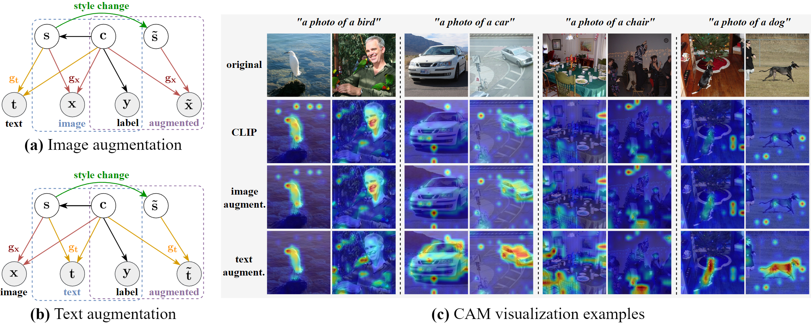
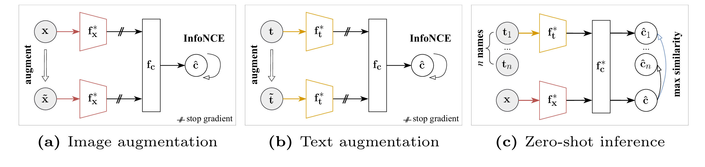

# CLAP: Isolating Content from Style through Contrastive Learning with Augmented Prompts
---
[**Paper**] [(arxiv)](https://arxiv.org/abs/2311.16445)


<center> Causal generative models of vision-language data. </center>
.


<center> Refining CLIP through data augmentation.  </center>

---

## Installation

1. Install [CLIP](https://github.com/openai/CLIP) and the following pakages:

``` shell
pip install pyyaml
pip install tensorboard
pip install scikit-learn
```

2. Install [EDA](https://github.com/jasonwei20/eda_nlp) for the ablative experiments.

---
## Preparing Datasets

Download [PACS](https://drive.google.com/file/d/1m4X4fROCCXMO0lRLrr6Zz9Vb3974NWhE/view), [VLCS](https://www.mediafire.com/file/7yv132lgn1v267r/vlcs.tar.gz/file), [OfficeHome](https://www.hemanthdv.org/officeHomeDataset.html) and [DomainNet (cleaned version)](https://ai.bu.edu/M3SDA/) datasets to the "./data" directory, and arrange them as the following directory structure:

``` shell
- data/datasets/PACS   # dataset
    - art_painting   # domains
    - ...
- data/datasets/VLCS
    - Caltech101
    - ...
- data/datasets/OfficeHome
    - Art
    - ...
- data/datasets/DomainNet
    - clipart
    - ...
```

<!-- Download [synthetic images]() for ImAug comparing experiments, extrat it to the following structure:
``` shell
- data/synthesis_images
    - aircraft carrier
        - ...
    - airplane
    - ...
``` -->

Run this code for generating the few-shot training data:
``` shell
python gen_fewshot_dset.py
```

---
## Usage
**Training**
``` shell
python train_clap.py config/[train_config].yaml     # Refer to the template "train_CLAP_VLCS_ViTB.py" for configuration details.
```
**Evaluation**
``` shell
python eval_zeroshot.py config/[eval_config].yaml   # evaluating zero-shot performance, both in natural and adversarial settings
python eval_fewshots.py config/[eval_config].yaml   # evaluating few-shot (1,4,8,16,32) performance, in the natural setting.
python eval_oneshot_adv.py config/[eval_config].yaml   # evaluating one-shot performance, in the adversarial setting.
```

---
## Archived artifacts
``` shell
- runs/Ablations_Prompts_Sources    # Ablative study results on analyzing prompt sources
- runs/Results_CLAP_ViTB    # Main results of CLAP using ViT-B/16 CLIP model
- runs/Results_CLAP_ViTL    # Zero-shot performance of CLAP repeated experiments on ViT-L/14 model
- runs/Results_CLIP_ViTB    # CLIP baseline of CLIP-B/16 model size
- runs/Results_CLIP_ViTL    # CLIP baseline of CLIP-L/14 model size
- runs/Results_ImgAug_ViTB   # ImAug experimental results using ViT-B/16 CLIP model
```