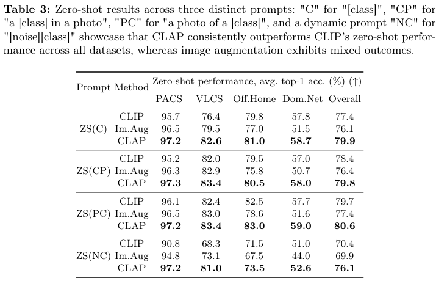
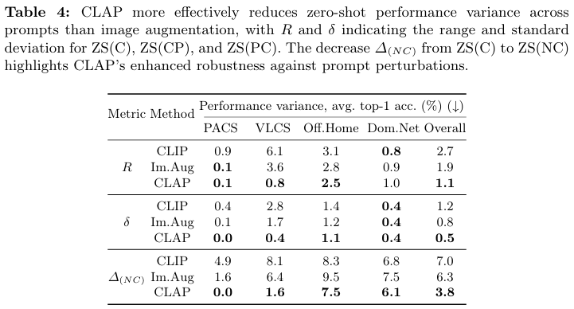
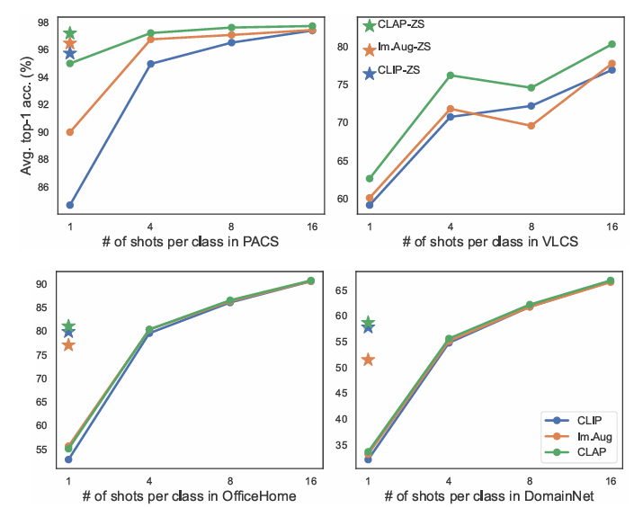
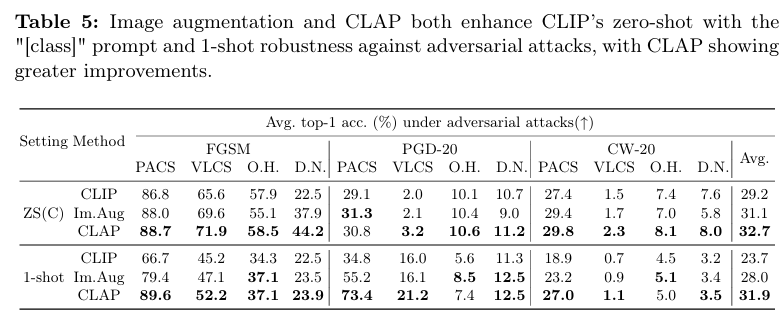

# CLAP: Isolating Content from Style through Contrastive Learning with Augmented Prompts
---
[**Paper**] [(arxiv)](https://arxiv.org/abs/2311.16445)


<center> Figure 1 Causal generative models of vision-language data. </center>
~


<center> Figure 2 Refining CLIP through data augmentation.  </center>

---

## 1. Installation

a) Install [CLIP](https://github.com/openai/CLIP) and the following pakages:

``` shell
pip install pyyaml
pip install tensorboard
pip install scikit-learn
```

b) Install [EDA](https://github.com/jasonwei20/eda_nlp) for the ablative experiments.

---
## 2. Preparing datasets
Download [PACS](https://drive.google.com/file/d/1m4X4fROCCXMO0lRLrr6Zz9Vb3974NWhE/view), [VLCS](https://www.mediafire.com/file/7yv132lgn1v267r/vlcs.tar.gz/file), [OfficeHome](https://www.hemanthdv.org/officeHomeDataset.html) and [DomainNet (cleaned version)](https://ai.bu.edu/M3SDA/) datasets to the "./data" directory, and arrange them as the following directory structure:

``` kotlin
data/
└── datasets/
   ├── PACS/                       // dataset
   │   ├── art_painting/           // domain
   │   │   ├── dog/                // class name
   │   │   │   ├── sample1.jpg
   │   │   │   ├── sample2.jpg
   │   │   │   └── ...
   │   │   ├── ...
   │   ├── ...
   ├── VLCS/
   │   ├── Caltech101/
   │   ├── ...
   ├── OfficeHome/
   │   ├── Art/
   │   ├── ...
   └── DomainNet/
       ├── clipart/
       ├── ...
```

To generate a YAML file containing the class names and template prompts for training CLAP with your own dataset, follow these steps:
1. Organize your dataset into the following directory structure:
```kotlin
Dataset name/
├── Domain name/
│   ├── Class name 1/
│   │   ├── Sample1.jpg
│   │   ├── Sample2.jpg
│   │   └── ...
│   ├── Class name 2/
│   │   ├── Sample1.jpg
│   │   ├── Sample2.jpg
│   │   └── ...
│   └── ...
└── ...
```
2. Create a YAML file ([dataset_name].yaml) that contains the class names by runing:
```shell
python gen_class_names dataset_name     # `dataset_name` is the directory name of your own Dataset
```

3. Generate template prompts for training CLAP:
```shell
python gen_prompts.py dataset_name
```

<!-- Download [synthetic images]() for ImAug comparing experiments, extrat it to the following structure:
``` shell
- data/synthesis_images
    - aircraft carrier
        - ...
    - airplane
    - ...
``` -->

#### Few-shot samples
Run this code to generate the few-shot training data for evaluating the linear probe setting:
``` shell
python gen_fewshot_dset.py dataset_name
```

---
## 3. Usage
### 3.1 Training

Run the following script for training a CLAP disentangled network:
``` shell
python train_clap.py config/[train_config].yaml     # Refer to the template "train_CLAP_VLCS_ViTB.py" for configuration details.
```
Here, we use our configurations of using CLIP ViT-B/16 on VLCS dataset as an example of the `[train_config].yaml`:

``` yaml
# train_CLAP_VLCS_ViTB.yaml

# [SEED]
manual_seed: 2024   

# [NETWORKS]
clip_name: ViT-B/16   
latent_dim: 512           # Latent dimension of the disentangled network
out_dim: 512              # Output dimension of the disentangled network, we set it the same with CLIP feature dim in our experiments.
repeat: 0                 # Add repeated layers of the network, we always set it to 0 in our experiments.
scale: 1                  # The scale parameter of the disentangled network is always 1 in traning.
activation: torch.nn.SiLU   
drop_rate_psi_n_beta: 0   # dropout, not used
drop_rate_theta: 0        # dropout, not used
which_network: 
  - beta                  # beta for text modality, i.e. training CLAP
  # - psi                 # uncomment psi and comment beta, if taining Im.Aug
weights_path:             # not used 
load_weights:             # not used

# [DATASETS]
datasets:     
  - VLCS                  # The test dataset for this training, to determine path to prompt and class names...
batch_size: 8             # Batch size, we set it lager than the number of class names
shuffle: True             # Shuffle the dataloader if True
prompts_path: data/prompts_template/VLCS    # Specify the path to training prompt source
images_path:              # Specify the path to synthetic training images if training Im.Aug, otherwise leave it empty.

# Prompt augmentation configurations, invalid when training Im.Aug
prompt_aug_params:        
  eda: False              # If use eda, then the belowing args are invalid; Our CLAP set it to False.
  replace: False          # If True, replace property to a new word but not erase it, we set it to False.
  object_size: 0.5        # The probability of deleting/replacing object size property
  object_color: 0.5       # The probability of deleting/replacing object color property
  img_type:  0            # The probability of deleting/replacing image type property
  art_style: 0            # The probability of deleting/replacing art style property
  reverse: 0.5            # The probability of swapping the statement order of the prompt.
noise_len: 4              # The context length of random noise augmentation (set it to zero, when the class names is enough big)
std: 0.02                 # The standard deviation of random norm noise.

# Image augmentation configurations, invalid when training CLAP
augmentations:  
  mask:       
    - 0.0   # 0.5    # probability
    - 0.25      # max ratio of maskd blocks
    - 8         # lower bound of [img_W/block_w]
    - 16        # upper bound of [img_W/block_w]
  perspective: 0.0 # 0.3  # max distortion scale
  crop:
    - 0.64      # lower bound of cropped area ratio
    - 1.0       # upper bound of cropped area ratio
  hflip: 0    # 0.5 # probability


# [HYPER PARAMETERS]
optimizer: torch.optim.Adam     # Optimizer for training CLAP
learning_rate: 0.0001           # Initial learning rate
weight_decay: 0                 
total_steps: 8000               # Total training steps
tau_txt: 0.5                    # Temperature value of the loss function, only valid for CLAP
tau_cnt: 1                      # Only valid for CLAP
scale_coef: 1                   # Lambda coefficient to balance loss terms, only valid for CLAP
tau_img: 0.5                    # Temperature value of Im.Aug loss function
log_frequency: 50               
check_frequency: 480            # We generate 480 prompt samples per class, so we check loss at every 480 steps.
early_stop:
  patience: 5                   # Patience of checking steps for early stopping
  delta: 0.01                   # Delta value for early stopping

```

### 3.2 Evaluation
``` shell
python eval_zeroshot.py config/[eval_config].yaml   # evaluating zero-shot performance, both in natural and adversarial settings
python eval_fewshots.py config/[eval_config].yaml   # evaluating few-shot (1,4,8,16,32) performance, in the natural setting.
python eval_oneshot_adv.py config/[eval_config].yaml   # evaluating one-shot performance, in the adversarial setting.
```

Here, we use our configurations of using CLIP ViT-B/16 on the VLCS dataset as an example for the `[eval_config].yaml`:
``` yaml
# eval_CLAP_VLCS_ViTB.yaml

# [SEED]
manual_seed: 2024
eval_clip: False

# [NETWORKS]
clip_name: ViT-B/16 
latent_dim: 512        # Keep the same with your training configuration
out_dim: 512           # Keep the same with your training configuration
repeat: 0              # Keep the same with your training configuration
scale: 0.056           # alpha value of the disentangled network for inference
activation: torch.nn.SiLU  

# [model to be evaluated] 
which_network: 
  - beta                                   # CLAP, keep the same with your training configuration.
ckpt_path: runs/Results_CLAP_ViTB/VLCS     # Path to your checkpoints path of your trained disentangled network
                                           # If `eval_clip: True`, specify a directory to save the evaluation results.

# [EVAL DATASETS]
eval_sets:
  VLCS:               # Dataset name, keep the same with your training configuration
    - Caltech101      # Domains in the dataset
    - LabelMe
    - SUN09
    - VOC2007
```
**Search alpha value for inference:**  To search for an optimal alpha value for inference, please refer to the code in the `search_alpha.py` script. You may want to modify the `scale_list` variable in line 120 or call the `binary_search` function in line 88 to adjust the search intervals.

### 3.3 (Optional) Training Im.Aug
If you would like to use this codebase to train image augmentation, you can organize the training images with the following directory structure:
```kotlin
data/synthesis_images/          // dataset
    ├── class_name1/
    │   ├── prompt1/            // a prompt of the class_name1
    │   │   ├── image1.jpg      // synthesis image
    │   │   ├── image2.jpg
    │   │   └── ...
    │   ├── class2/
    │   │   ├── image1.jpg
    │   │   ├── image2.jpg
    │   │   └── ...
    │   └── ...
    └── ...
```
To use Stable Diffusion v2.1 for image synthesis, you can run the provided script:
```shell
python gen_images.py dataset_name   # Here `dataset_name' if you prepared test dataset (Sec. 2)
```
You might consider using more advanced stable diffusion models to generate more coherent and realistic images, as this technology is rapidly evolving. Utilizing a more powerful generative model could potentially enhance the performance of Im.Aug. Once you have prepared the synthetic images, you can train and evaluate Im.Aug in a manner similar to CLAP.


---
## 4. Archived artifacts for reproductivity
``` kotlin
runs/
    ├── Ablations_Prompts_Sources   // Ablative study results on analyzing prompt sources
    ├── runs/Results_CLAP_ViTB      // Main results of CLAP using ViT-B/16 CLIP model
    ├── runs/Results_CLAP_ViTL      // Zero-shot performance of CLAP repeated experiments on ViT-L/14 model
    ├── Results_CLIP_ViTB           // CLIP baseline of CLIP-B/16 model size
    ├── Results_CLIP_ViTL           // CLIP baseline of CLIP-L/14 model size
    └── Results_ImgAug_ViTB         // ImAug experimental results using ViT-B/16 CLIP model
```

---
## 5. Experiment results
### 5.1 Zero-shot performance



### 5.2 Few-shot performance


### 5.3 Adversarial Attacking Resilience


<!-- ---
#### Cite -->
