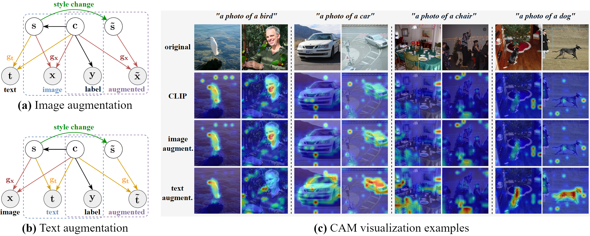
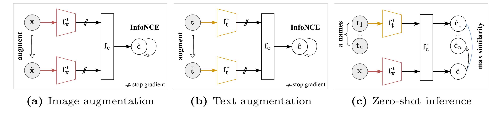

# CLAP: Isolating Content from Style through Contrastive Learning with Augmented Prompts

**Official Implementation of the ECCV 2024 Paper**  
📄 *"CLAP: Isolating Content from Style through Contrastive Learning with Augmented Prompts"*  
🔗 **Paper (arXiv):** [https://arxiv.org/abs/2311.16445](https://arxiv.org/abs/2311.16445)  

---

## 🌐 Overview

This repository provides the **official implementation** of **CLAP (Contrastive Learning with Augmented Prompts)**, published at **ECCV 2024**.

CLAP introduces a *contrastive disentanglement framework* that isolates **content** from **style** in vision–language models such as CLIP.  
Through **prompt augmentation** and **contrastive supervision**, CLAP explicitly separates invariant content factors from style-related variations (e.g., domain, texture, or artistic bias).

<p align="center">
  <br>
  <em>Figure 1. Causal generative models of vision-language data.</em>
</p>

<p align="center">
  <br>
  <em>Figure 2. CLAP refines CLIP via augmented prompt contrastive learning.</em>
</p>

---

## ⚙️ 1. Installation

a) Install [CLIP](https://github.com/openai/CLIP) and dependencies:
```bash
pip install pyyaml tensorboard scikit-learn
```

b) For the ablative experiments, install [EDA (Easy Data Augmentation)](https://github.com/jasonwei20/eda_nlp):
```bash
pip install git+https://github.com/jasonwei20/eda_nlp.git
```

---

## 🗂️ 2. Preparing Datasets

Download the following datasets into `./data/datasets/`:
- [PACS](https://drive.google.com/file/d/1m4X4fROCCXMO0lRLrr6Zz9Vb3974NWhE/view)
- [VLCS](https://drive.google.com/uc?id=1skwblH1_okBwxWxmRsp9_qi15hyPpxg8)
- [OfficeHome](https://www.hemanthdv.org/officeHomeDataset.html)
- [DomainNet (cleaned version)](https://ai.bu.edu/M3SDA/)

Directory structure:
```
data/
└── datasets/
    ├── PACS/
    │   ├── art_painting/
    │   ├── ...
    ├── VLCS/
    ├── OfficeHome/
    └── DomainNet/
```

To generate a YAML file containing the class names and template prompts for training CLAP with your own dataset, follow these steps: 

1. Organize your dataset into the following directory structure:
```
Dataset name/
├── Domain name/
│   ├── Class name 1/
│   │   ├── Sample1.jpg
│   │   ├── Sample2.jpg
│   │   └── ...
│   ├── Class name 2/
│   │   ├── Sample1.jpg
│   │   ├── Sample2.jpg
│   │   └── ...
│   └── ...
└── ...
```
2. Create a YAML file ([dataset_name].yaml) that contains the class names by runing:

```shell
python gen_class_names dataset_name     # `dataset_name` is the directory name of your own Dataset
```
3. Generate template prompts for training CLAP:
```shell
python gen_prompts.py dataset_name
```
#### Few-shot samples 

Run this code to generate the few-shot training data for evaluating the linear probe setting:
```shell
python gen_fewshot_dset.py dataset_name
```
---

## 🚀 3. Usage

### 3.1 Training CLAP
```bash
python train_clap.py config/[train_config].yaml
```

Example configuration: `config/train_CLAP_VLCS_ViTB.yaml`
```yaml
# [SEED]
manual_seed: 2024   

# [NETWORKS]
clip_name: ViT-B/16   
latent_dim: 512           # Latent dimension of the disentangled network
out_dim: 512              # Output dimension of the disentangled network, we set it the same with CLIP feature dim in our experiments.
repeat: 0                 # Add repeated layers of the network, we always set it to 0 in our experiments.
scale: 1                  # The scale parameter of the disentangled network is always 1 in traning.
activation: torch.nn.SiLU   
drop_rate_psi_n_beta: 0   # dropout, not used
drop_rate_theta: 0        # dropout, not used
which_network: 
  - beta                  # beta for text modality, i.e. training CLAP
  # - psi                 # uncomment psi and comment beta, if taining Im.Aug
weights_path:             # not used 
load_weights:             # not used

# [DATASETS]
datasets:     
  - VLCS                  # The test dataset for this training, to determine path to prompt and class names...
batch_size: 8             # Batch size, we set it lager than the number of class names
shuffle: True             # Shuffle the dataloader if True
prompts_path: data/prompts_template/VLCS    # Specify the path to training prompt source
images_path:              # Specify the path to synthetic training images if training Im.Aug, otherwise leave it empty.

# Prompt augmentation configurations, invalid when training Im.Aug
prompt_aug_params:        
  eda: False              # If use eda, then the belowing args are invalid; Our CLAP set it to False.
  replace: False          # If True, replace property to a new word but not erase it, we set it to False.
  object_size: 0.5        # The probability of deleting/replacing object size property
  object_color: 0.5       # The probability of deleting/replacing object color property
  img_type:  0            # The probability of deleting/replacing image type property
  art_style: 0            # The probability of deleting/replacing art style property
  reverse: 0.5            # The probability of swapping the statement order of the prompt.
noise_len: 4              # The context length of random noise augmentation (set it to zero, when the class names is enough big)
std: 0.02                 # The standard deviation of random norm noise.

# Image augmentation configurations, invalid when training CLAP
augmentations:  
  mask:       
    - 0.0   # 0.5    # probability
    - 0.25      # max ratio of maskd blocks
    - 8         # lower bound of [img_W/block_w]
    - 16        # upper bound of [img_W/block_w]
  perspective: 0.0 # 0.3  # max distortion scale
  crop:
    - 0.64      # lower bound of cropped area ratio
    - 1.0       # upper bound of cropped area ratio
  hflip: 0    # 0.5 # probability


# [HYPER PARAMETERS]
optimizer: torch.optim.Adam     # Optimizer for training CLAP
learning_rate: 0.0001           # Initial learning rate
weight_decay: 0                 
total_steps: 8000               # Total training steps
tau_txt: 0.5                    # Temperature value of the loss function, only valid for CLAP
tau_cnt: 1                      # Only valid for CLAP
scale_coef: 1                   # Lambda coefficient to balance loss terms, only valid for CLAP
tau_img: 0.5                    # Temperature value of Im.Aug loss function
log_frequency: 50               
check_frequency: 480            # We generate 480 prompt samples per class, so we check loss at every 480 steps.
early_stop:
  patience: 5                   # Patience of checking steps for early stopping
  delta: 0.01                   # Delta value for early stopping
```

---

### 3.2 Evaluation
Evaluate zero-shot and few-shot performance:
```bash
python eval_zeroshot.py config/[eval_config].yaml   # evaluating zero-shot performance, both in natural and adversarial settings
python eval_fewshots.py config/[eval_config].yaml   # evaluating few-shot (1,4,8,16,32) performance, in the natural setting.
python eval_oneshot_adv.py config/[eval_config].yaml   # evaluating one-shot performance, in the adversarial setting.
```

Search alpha values for inference:
```bash
python search_alpha.py
```

---

### 3.3 (Optional) Image Augmentation Training
To train Im.Aug (image augmentation variant):
```bash
python gen_images.py dataset_name
```

Then train as:
```bash
python train_clap.py config/train_ImgAug.yaml
```

---

## 🧩 4. Archived Artifacts

Directory structure for reproducibility:
```
runs/
├── Ablations_Prompts_Sources/
├── Results_CLAP_ViTB/
├── Results_CLAP_ViTL/
├── Results_CLIP_ViTB/
├── Results_CLIP_ViTL/
└── Results_ImgAug_ViTB/
```

---

## 🧾 Citation

If you find CLAP useful, please cite:

```bibtex
@inproceedings{Cai2024CLAP,
  title     = {CLAP: Isolating Content from Style through Contrastive Learning with Augmented Prompts},
  author    = {Yichao Cai and Yuhang Liu and Zhen Zhang and Javen Qinfeng Shi},
  booktitle = {European Conference on Computer Vision (ECCV)},
  pages     = {130--147},
  year      = {2024}
}
```

---

## 🫶 Acknowledgements

This repository builds upon:
- [OpenAI CLIP](https://github.com/openai/CLIP)
- [EDA (Wei and Zou, 2019)](https://github.com/jasonwei20/eda_nlp)

---

> ✨ *For details, results, and visualizations, please refer to the official paper:*  
> 📄 [**CLAP: Isolating Content from Style through Contrastive Learning with Augmented Prompts (ECCV 2024)**](https://arxiv.org/abs/2311.16445)
